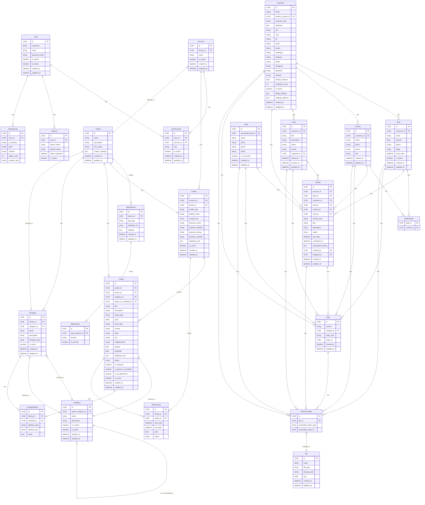
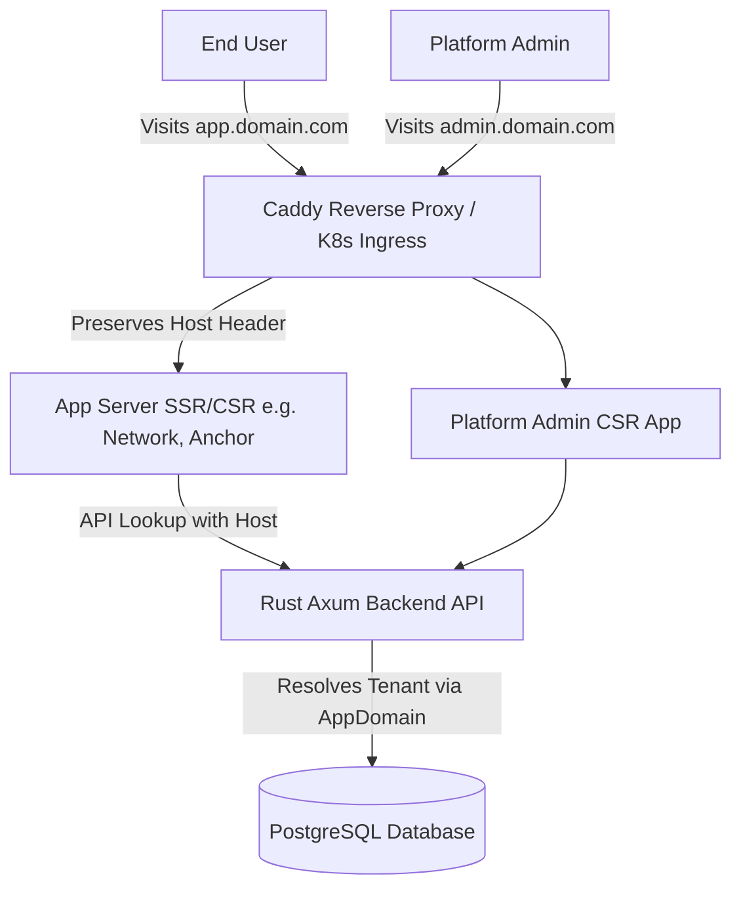

## Deployment & Infrastructure Architecture

The system uses a highly scalable Docker multi-stage environment natively supporting dynamic multi-tenancy. A single `Tenant` (Organization) can run multiple `AppInstances` (e.g. Network, Anchor) which share the underlying CRM and Data APIs, isolated securely via `tenant_id`. GitHub Actions automates CI/CD, pushing `ghcr.io` containers into Kubernetes using Kustomize overlays.

---

&copy; Copyright Ruud Salym Erie & Oplyst International, LLC. All Rights Reserved.