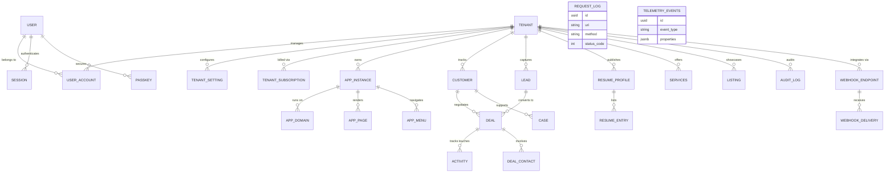

# Atlas Platform Database Architecture

The Atlas Platform operates on a **Single-Database, Multi-Tenant** architecture using PostgreSQL. All applications (`backend`, `anchor-app`, `network-app`) communicate with this strict, unified schema. Data segmentation is primarily enforced at the application layer through `tenant_id` foreign keys, preventing data leakage across organizational boundaries while keeping infrastructure costs minimal.

This diagram demonstrates how tables are grouped logically into distinct domains:

### Key Architectural Concepts

**1. Tenant Context Engine (Multi-Tenancy)**
Every table specific to user data holds a `tenant_id` UUID physically mapping back to the `tenant` table. The backend server functions (using `Axum`) inject the correct `tenant_id` into the request context dynamically based on the requesting URL's `domain_name` (via `app_domains`). Queries utilizing SeaORM are actively filtered by this globally injected context.

**2. Dynamic "App Instance" Resolution**
Instead of spinning up physically separate codebases or databases for each micro-SaaS you deploy, Atlas routes HTTP hostnames to an `app_instance` record. The `app_type` flag (e.g. `Network`, `anchor`) tells Leptos which SSR rendering engine to dispatch, and pulls localized `settings` JSON to customize colors, copy, and layout on exactly the same infrastructure.

**3. Headless CMS / Anchor Data Models**
Tables like `resume_entries`, `services`, and `app_pages` serve as a headless CMS layer. When a user requests `buildwithruud.com`, the API looks up the assigned `tenant_id` from the `app_domains` list, then grabs the associated `resume_profiles` strictly associated with that ID.

**4. Fully Synchronized Billing & Webhooks**
By placing `tenant_subscription` and `webhook_endpoint` entirely inside the unified schema, you eliminate split-brain architectural issues. When a webhook hits `/api/webhooks/paddle/`, it can directly map the Stripe/Paddle reference token onto the exact `tenant_id`, instantly updating user entitlements across all connected `app_instances`.
