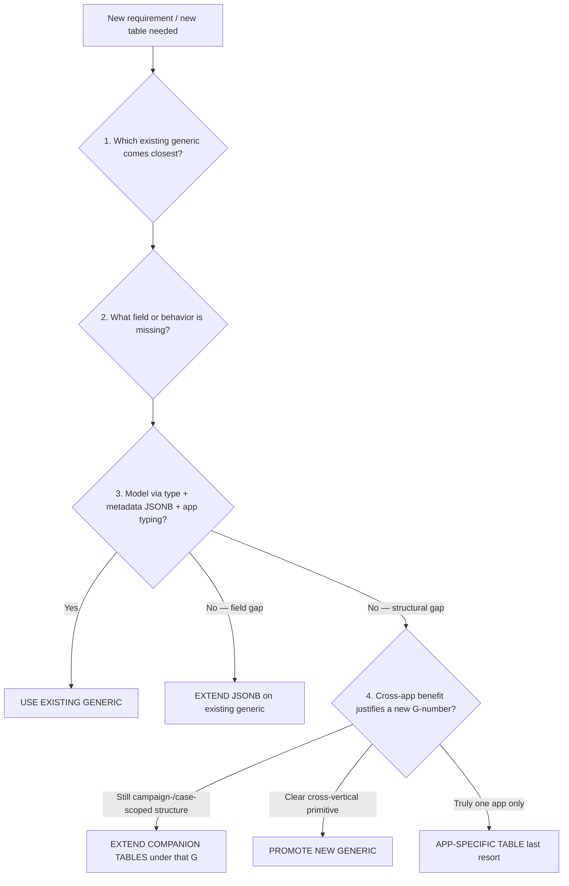

# Rule 7 — Generic Fitness Test

> **Status:** Living (canonical)  
> **Audience:** Anyone proposing a net-new table, migration, or new `G-XX` platform generic  
> **Registry of what exists:** [`docs/private/archive/CURRENT_STATE.md`](../private/archive/CURRENT_STATE.md) (Platform Generics Registry)  
> **Decision diagram:** [`diagrams/generic_fitness_test_flow.mmd`](./diagrams/generic_fitness_test_flow.mmd)

This is the **mandatory** standard for deciding whether a need becomes a new platform generic, an extension of an existing one, or an app-specific table. Historical registry/spec docs (`platform_generics.md`, `platform_generics_v2.md`, `platform_generics_v3.md`) describe *what* was built; **this file owns Rule 7**.

---

## Core principle

Before any AtlasApp (or platform change) writes a **net-new table**, prove that none of the existing platform generics can satisfy the need.

This prevents Atlas from becoming a collection of slightly different CRMs, asset systems, case systems, and document stores.

**Only after** completing this fitness test (and recording the writeup below) may you:

- Add a CorePlatform / shared migration for a new `atlas_*` table, or
- Add an app-specific migration under `AtlasApp::migrations()`, or
- Propose a new `G-XX` number.

---

## Decision tree (gates)



Source diagram (may lag slightly): [`generic_fitness_test_flow.mmd`](./diagrams/generic_fitness_test_flow.mmd). Prefer the gates in this doc when they refine the diagram (especially **companion tables**).

### Gate meanings

| Gate | Meaning | Typical work |
|------|---------|----------------|
| **USE EXISTING** | Instantiate via service + typed `*_type` (e.g. `case_type = 'maintenance'`) | No new table |
| **EXTEND JSONB** | Add keys to `*_metadata` / similar; app-level typing | Migration optional (docs/contract only) |
| **EXTEND COMPANION** | New `atlas_*` table that clearly belongs to an existing G family (e.g. `atlas_campaign_enrollments` under G-19) | CorePlatform migration; **same G-number**, not a new one |
| **PROMOTE NEW GENERIC** | Cross-app structural primitive missing from the registry | New G-id, arch review, CorePlatform migration + service |
| **APP-SPECIFIC** | No cross-app reuse; justify in app integration notes | `AtlasApp::migrations()` only |

**Companion tables are not a new generic.** If the closest answer to Q1 is G-19 and you need enrollments, events, or campaign-scoped share codes, you extend G-19’s table family — you do **not** invent G-37.

---

## Fitness questions (must answer)

When introducing a new table, answer in plan/PR notes (same spirit as `atlas_app_integration.md`):

1. **Which existing generic comes closest?**  
   Use the registry in [`CURRENT_STATE.md`](../private/archive/CURRENT_STATE.md). Closest may be G-19 campaigns, G-13 cases, G-31 leads, invite codes, G-36 programs, etc.

2. **What specific field or behavior is missing?**

3. **Can it be modeled as `*_type` + `*_metadata` JSONB + app-level service typing?**  
   - Yes → USE EXISTING or EXTEND JSONB  
   - No, only a few app keys → EXTEND JSONB  
   - No, need UNIQUE constraints / first-class rows / list queries → structural gap → Q4

4. **Platform-level roles / permissions?** → Consider **G-32** `atlas_rbac` before inventing another permission table.

5. **Multi-tenant deployment topology / instance mode?** → Consider **G-33** `atlas_app_deployment_config`.

6. **Cross-tenant vendor / provider discovery?** → Consider **G-34** `atlas_vendor_marketplace`.

7. **If still not covered: what cross-vertical benefit justifies a new generic (new G-number)?**  
   If the structure is still “rows that belong to an existing generic,” prefer **EXTEND COMPANION**.  
   If the benefit is Folio-only and not campaign-/platform-scoped, consider **APP-SPECIFIC**.

---

## When to run 5-lens promote scoring

Run the full **5-lens** analysis **only** when the gate is **PROMOTE NEW GENERIC** (Q4 cross-app benefit is clear).

Template and lenses: [`docs/private/prompts/platform_generics_gap_analysis_prompt.md`](../private/prompts/platform_generics_gap_analysis_prompt.md).  
Historical scored candidates: [`platform_generics_gap_analysis.md`](../../platform_generics_gap_analysis.md) (repo root under `atlas-platform/`).

Do **not** run a full promote score for USE / EXTEND JSONB / EXTEND COMPANION / APP-SPECIFIC — the short Q1–Q4 writeup is enough.

---

## Required writeup template

Copy into the plan or PR before coding:

```markdown
### Rule 7 — Generic Fitness Test

| Q | Answer |
|---|--------|
| 1. Closest generic? | G-XX `atlas_…` (also considered: …) |
| 2. Missing field/behavior? | … |
| 3. Model via type + JSONB? | Yes / No — field gap / No — structural gap |
| 4–7. G-32/33/34 or cross-app new G? | … |

**Gate:** USE EXISTING | EXTEND JSONB | EXTEND COMPANION (G-XX) | PROMOTE NEW GENERIC | APP-SPECIFIC

**Rationale:** …
```

If **PROMOTE NEW GENERIC**, attach a short 5-lens scorecard (Lens 1–5 + recommendation) from the gap-analysis prompt.

---

## Example (correct gate)

**Need:** Pre-minted Friends & Family share codes for print QR packs, tied to a campaign.

| Q | Answer |
|---|--------|
| 1. Closest? | **G-19 `atlas_campaigns`** (not invite codes / G-36 for auth invites) |
| 2. Missing? | Unique share `code`, display name, QR targets, fulfillment stub |
| 3. JSONB on campaign? | No — need UNIQUE codes and list/QR APIs |
| 4. New G-number? | Weak — still campaign-scoped; same family as enrollments/events |

**Gate:** **EXTEND COMPANION (G-19)** — e.g. `atlas_campaign_ambassadors` — **not** a new generic.

---

## Related docs

| Doc | Role |
|-----|------|
| [`CURRENT_STATE.md`](../private/archive/CURRENT_STATE.md) | Living registry of G-01…G-36+ and ops ground truth |
| [`platform_generics_v3.md`](./platform_generics_v3.md) | Implemented generics quick ref (Rev 5); Rule 7 §1 defers here |
| [`platform_generics_v2.md`](./platform_generics_v2.md) / [`platform_generics.md`](./platform_generics.md) | Historical specs |
| [`atlas_app_integration.md`](../atlas_app_integration.md) | AtlasApp trait; must run Rule 7 before app migrations |
| [`platform_generics_gap_analysis_prompt.md`](../private/prompts/platform_generics_gap_analysis_prompt.md) | 5-lens promote scoring |
