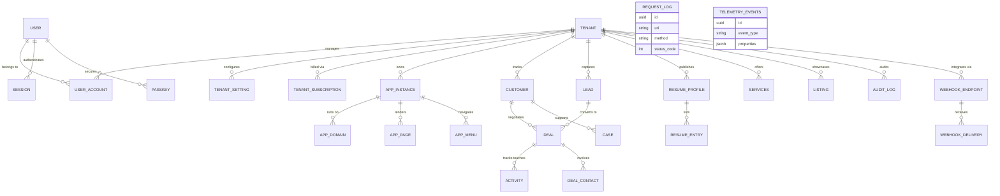
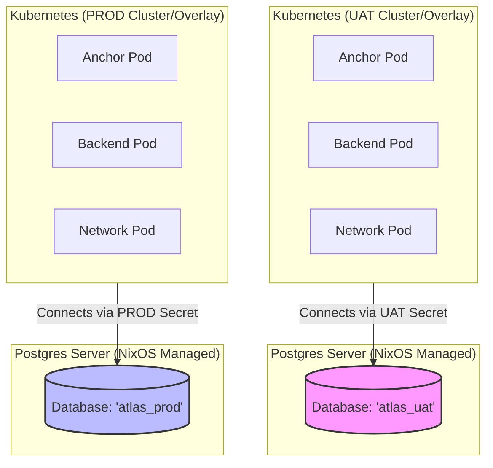
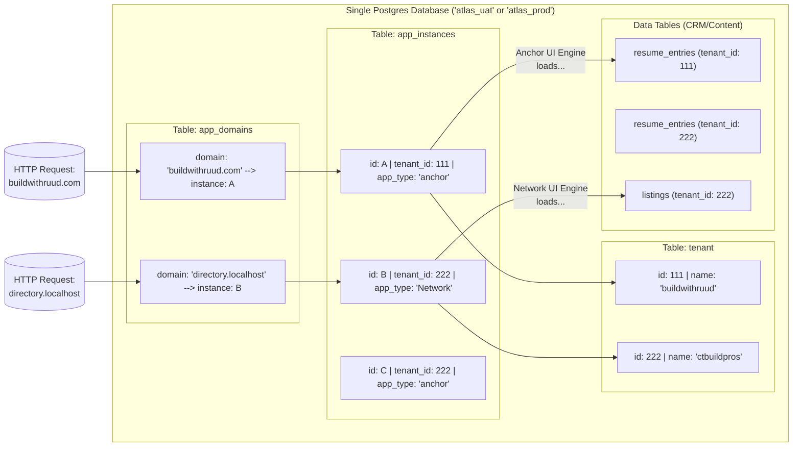

# Atlas Platform Database Architecture

The Atlas Platform operates on a **Single-Database, Multi-Tenant** architecture using PostgreSQL. All applications (`backend`, `anchor-app`, `network-app`) communicate with this strict, unified schema. Data segmentation is primarily enforced at the application layer through `tenant_id` foreign keys, preventing data leakage across organizational boundaries while keeping infrastructure costs minimal.

This diagram demonstrates how tables are grouped logically into distinct domains:

## 1. Environment & Infrastructure Isolation (UAT vs. PROD)

In modern SaaS architecture, there are three common ways to separate data. Atlas employs a **Physically Separated Environment** model, but internally runs a **Shared Schema Multi-Tenant** model.

### Physical Separation by Environment
PostgreSQL achieves environmental isolation (UAT vs Production) by utilizing entirely separate **Network Instances** or **Logical Databases** (`DATABASE_NAME`). 

* **UAT** executes against a local/ephemeral PostgreSQL service, loading configs strictly from `k8s/overlays/uat/config.yaml` (`DATABASE_HOST: 10.42.0.1`, `DATABASE_NAME: atlas_uat`). 
* **PROD** executes against `atlas_prod`. Code executing in UAT physically cannot see Prod data. Note: legacy databases like `ruud` and `anchor` have been fully deprecated and removed.

---

## 2. Shared-Schema Multi-Tenancy (How Tenants & Apps share the DB)

A major question when building multi-tenant apps is: *Do you create a new PostgreSQL Database/Schema for every customer, or do they share one?* 

Atlas uses a **Shared-Schema (Single Database)** approach. Postgres does **not** create new databases when a user registers. Instead, **Row-Level Organization** isolates customers. 

When a request arrives, the application maps the domain to a `tenant_id` and an `app_type`.

### Key Architectural Concepts

**1. Tenant Context Engine (Row-Level Security)**
Every table specific to user data holds a `tenant_id` UUID physically mapping back to the `tenant` table. The backend server functions (using `Axum`) inject the correct `tenant_id` into the request context dynamically based on the requesting URL's `domain_name` (via `app_domains`). Queries utilizing SeaORM are actively filtered by this globally injected context.

**2. Dynamic "App Instance" Resolution**
Instead of spinning up physically separate codebases or databases for each micro-SaaS you deploy, Atlas routes HTTP hostnames to an `app_instance` record. The `app_type` flag (e.g. `Network`, `anchor`) tells Leptos which SSR rendering engine to dispatch, and pulls localized `settings` JSON to customize colors, copy, and layout on exactly the same infrastructure.

**3. Headless CMS / Anchor Data Models**
Tables like `resume_entries`, `services`, and `app_pages` serve as a headless CMS layer. When a user requests `buildwithruud.com`, the API looks up the assigned `tenant_id` from the `app_domains` list, then grabs the associated `resume_profiles` strictly associated with that ID.

**4. Fully Synchronized Billing & Webhooks**
By placing `tenant_subscription` and `webhook_endpoint` entirely inside the unified schema, you eliminate split-brain architectural issues. When a webhook hits `/api/webhooks/paddle/`, it can directly map the Stripe/Paddle reference token onto the exact `tenant_id`, instantly updating user entitlements across all connected `app_instances`.

---

## 3. Migration Registry & Safety Architecture

To prevent deployment panics (e.g., K8s `CrashLoopBackOff` loops caused by SeaORM missing migration files), Atlas enforces strict rules on how migrations are written and registered.

### The Unified Registry Rule
* **Core Platform Migrations:** Only structural changes that affect the entire multi-tenant platform (users, billing, core tables) are allowed in `backend/src/migration/mod.rs` (the `base` vector).
* **App-Specific Migrations:** Any migration that inserts tenant-specific content, seed data, or app-specific configurations (like Anchor CMS JSON payloads) **must** be registered within that application's trait implementation (e.g., `AnchorApp::migrations()`). 
* *Why?* If app migrations are split between the base registry and the app registry, it causes non-deterministic ordering during the SeaORM boot sequence, leading to fatal mismatch panics.

### The "Hardened Migration" Pattern
Silent failures in data updates are strictly forbidden. If a migration needs to target a specific tenant or payload (e.g., fixing a specific customer's UI padding), it must use a robust `DO $$` block in Postgres that enforces validation:
1. **Lookup Validation:** Always check if the target tenant/domain exists. If not, explicitly `RAISE EXCEPTION`.
2. **Update Validation:** After an `UPDATE`, capture `GET DIAGNOSTICS v_rows_affected = ROW_COUNT;`. If it is 0, `RAISE EXCEPTION`.
3. **Visibility:** End successful paths with `RAISE NOTICE 'SUCCESS...'` so CI deployment logs explicitly verify the data change occurred. 
*(See `m20260426_000001_hardened_ruud_payload.rs` for the canonical example).*
