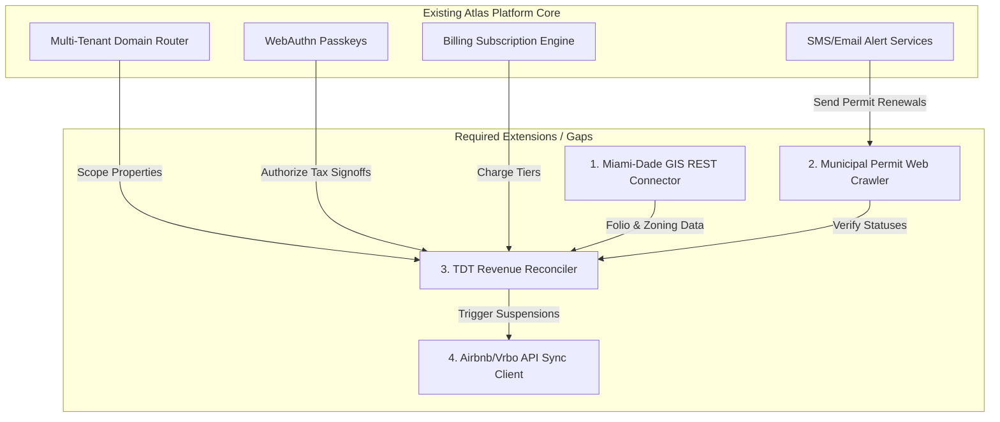

# Architectural Alignment & Gap Analysis: Hosting STR Compliance OS on the Atlas Platform

## 1. Introduction

From an enterprise software perspective, hosting **STR Compliance OS** on top of the **Atlas Platform** is an exceptional strategic move. 

By leveraging Atlas's **tenant boundary logic**, **WebAuthn security systems**, **notification infrastructure**, and **recurring Stripe billing engines**, we eliminate roughly 80% of the standard SaaS boilerplate. This document reviews the compliance product's alignment with Atlas, identifies functional gaps, and provides the step-by-step Rust integration blueprint.

---

## 2. Capability Mapping: What Atlas Provides Out-of-the-Box

The following native capabilities of the Atlas Platform align directly with the STR Compliance OS requirements:

| STR Compliance OS Feature Requirement | Existing Atlas Platform Component | Integration Strategy & Mapping |
| :--- | :--- | :--- |
| **Operator Admin Subdomains** | Dynamic Multi-Tenant Subdomain Routing (`*.network.localhost`) | Each STR operator or property management company receives an isolated subdomain (e.g., `lux-rentals.compliance.localhost`) to manage properties and verify permit files. |
| **Tax Document Signatures** | Unified WebAuthn Registry & Passkeys | Approving monthly TDT filings or linking Airbnb credentials requires high-security passwordless verification via passkeys. |
| **Audit Trails for Inspectors** | Security Audit Ledger Spec (`spec_audit_ledger.md`) | Generates an unalterable append-only audit trail logging every GIS zoning check, permit change, tax generation, and auto-suspension. |
| **Inspector QR Web Pages** | Leptos SSR Shell Pattern (`leptos_ssr_shell_pattern.md`) | Used to render hyper-fast, highly optimized mobile-ready public inspector landing pages accessed via QR codes inside the units. |
| **Permit Expiry Alerts** | Dynamic Notification Infrastructure | The existing email and SMS provider traits (e.g. Twilio adapters) are mapped directly to send renewal alerts to hosts. |
| **Solo/Portfolio Billing Tiers** | Billing & Monetization Spec (`spec_billing_monetization.md`) | Natively maps the Stripe subscription logic to bill customers on Solo ($99), Portfolio ($249), or PM Pro ($499) schedules. |

---

## 3. Gap Analysis: What Needs to be Developed

While the Atlas baseline covers core identity, multi-tenancy, and billing, the STR Compliance OS requires localized regulatory adapters:



### Gap 1: Miami-Dade County GIS REST Connector
*   **The Problem:** Atlas cannot query local geographic properties or folios.
*   **The Solution:** Build a GIS client in `backend/src/services/gis_client.rs` that interfaces with the **Miami-Dade County Open Data REST APIs**. It takes street address inputs, extracts the official 13-digit Folio Number, and retrieves zoning details to verify STR permittability.

### Gap 2: Municipal Permit Web Scraper
*   **The Problem:** Municipalities do not provide webhooks for permit expiration or revocation.
*   **The Solution:** Develop a robust web crawler utility in `backend/src/services/permit_scraper.rs` that parses public CSS permit databases (like Miami Beach Citizen Hub) using the `reqwest` and `select` crates to check permit statuses daily.

### Gap 3: TDT Revenue Tax Engine
*   **The Problem:** Reconciling multi-platform OTA revenues and calculating dynamic tourist development tax balances.
*   **The Solution:** Build a calculations service in `backend/src/services/tax_calculator.rs` that implements the 6% county TDT math, parses platform offsets (Stripe/Airbnb files), and generates pre-filled tax forms.

### Gap 4: Airbnb & Vrbo API Sync Client
*   **The Problem:** Triggering listing deactivations when compliance failure is detected.
*   **The Solution:** Implement a channel sync service in `backend/src/services/ota_sync/` utilizing official Airbnb/Vrbo OAuth listings APIs to auto-toggle availability statuses when permits expire.

---

## 4. Architectural Integration Blueprint

To integrate STR Compliance OS as a native module, we will implement and register the `ComplianceApp` under the `AtlasApp` trait system.

```
atlas-platform/
│
├── apps/
│   ├── platform-admin/             # Admin dashboard to edit county zoning rules & check alerts
│   └── network-instance/           # Operator portals (permits, tax generator, inspector QR vault)
│
├── backend/
│   └── src/
│       ├── atlas_apps/
│       │   ├── mod.rs              # Register ComplianceApp in active apps
│       │   └── compliance_app.rs   # [NEW] Implements AtlasApp trait, registers endpoints
│       │
│       ├── handlers/
│       │   ├── properties.rs       # [NEW] Handles property additions & GIS queries
│       │   ├── permits.rs          # [NEW] Document uploads and verification
│       │   ├── taxes.rs            # [NEW] CSV ingestion & TDT form creation
│       │   └── listings.rs         # [NEW] Airbnb/Vrbo listings integrations
│       │
│       ├── services/
│       │   ├── gis_client.rs       # [NEW] Miami-Dade GIS REST API integration
│       │   ├── permit_scraper.rs   # [NEW] Municipal permit website crawler
│       │   └── tax_calculator.rs   # [NEW] TDT tax reconciliation engine
│       │
│       └── workers/
│           └── compliance_check.rs # [NEW] Asynchronous daily compliance monitor
```

### 4.1 Step-by-Step Implementation Strategy

#### Phase 1: DB Schema Migrations
Generate SeaORM migrations in `backend/migration/`:
```bash
cargo sea-orm-migration generate create_compliance_tables
```
This builds the `compliance_tenants`, `compliance_properties`, `property_permits`, `tdt_booking_receipts`, `tdt_monthly_reconciliations`, `active_ota_listings`, and `compliance_alerts` PostgreSQL tables.

#### Phase 2: Implement `ComplianceApp` Rust Module
Create `backend/src/atlas_apps/compliance_app.rs`:
```rust
use axum::Router;
use sea_orm::DatabaseConnection;
use crate::traits::AtlasApp;

pub struct ComplianceApp;

impl AtlasApp for ComplianceApp {
    fn name(&self) -> &'static str {
        "str_compliance_os"
    }

    fn public_router(&self) -> Router<DatabaseConnection> {
        Router::new()
            .route("/api/public/compliance/inspector/:qrcode", axum::routing::get(crate::handlers::properties::view_inspector_vault))
            .route("/api/public/compliance/lookup", axum::routing::post(crate::handlers::properties::public_lookup))
    }

    fn authenticated_router(&self) -> Router<DatabaseConnection> {
        Router::new()
            .route("/api/compliance/properties", axum::routing::post(crate::handlers::properties::create))
            .route("/api/compliance/permits", axum::routing::post(crate::handlers::permits::upload))
            .route("/api/compliance/taxes/ingest", axum::routing::post(crate::handlers::taxes::ingest_bookings))
            .route("/api/compliance/taxes/reconcile", axum::routing::get(crate::handlers::taxes::get_reconciliation))
            .route("/api/compliance/listings/sync", axum::routing::post(crate::handlers::listings::sync_listings))
    }

    async fn provision(&self, db: &DatabaseConnection, tenant_id: uuid::Uuid) -> Result<(), crate::Error> {
        // Seed default notification schedules and tax templates for the new STR operator tenant
        Ok(())
    }
}
```

#### Phase 3: Background Compliance Checker task
Spawn the daily checker inside `backend/src/main.rs` to audit permits and sync platforms:
```rust
tokio::spawn(async move {
    let mut interval = tokio::time::interval(tokio::time::Duration::from_secs(86400)); // Every 24 hours
    loop {
        interval.tick().await;
        if let Err(e) = crate::workers::compliance_check::run_audit_cycle(&db_pool).await {
            tracing::error!("Compliance scraping and OTA audit cycle failed: {:?}", e);
        }
    }
});
```

#### Phase 4: Frontend Development
1.  **Compliance Scorecard Widget:** A visual display on `apps/network-instance` illustrating active permit dates, noise index readings, and monthly tax statuses.
2.  **Prefilled TDT Tax PDF Viewer:** Displays the computed tax schedule and embeds a download button for the generated pre-filled Miami-Dade County tax document.

---

## 5. Architectural Recommendation

Hosting **STR Compliance OS** on top of the **Atlas Platform** is highly recommended. 

By offloading multi-tenancy, authentication, subscription billing, and notification dispatch to Atlas's robust infrastructure, the engineering team can focus entirely on perfecting the local county GIS queries, scraping CSS permit portals, and building bulletproof TDT tax filers. Registering this as an isolated `AtlasApp` ensures high code reliability, letting operators secure their businesses with absolute compliance.
