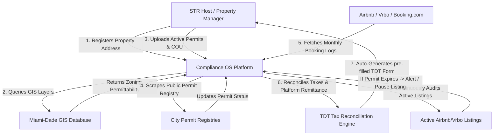
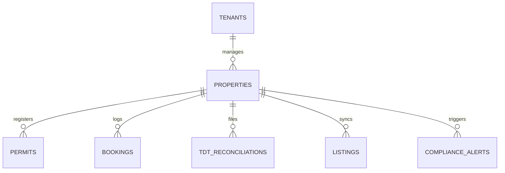
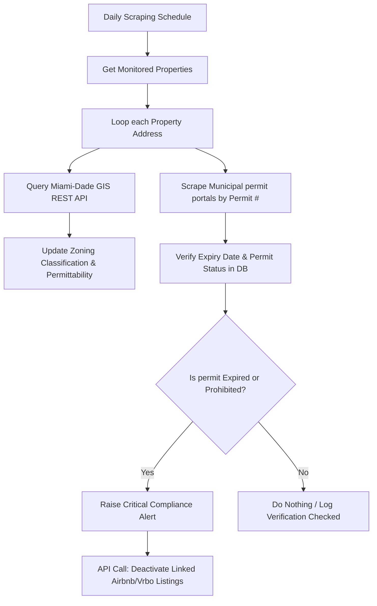

# Product Requirements & Technical Specification: STR Compliance OS

## 1. Executive Summary

### 1.1 Objective & Product Mission
**STR Compliance OS** is a regulatory compliance automation suite designed specifically for short-term rental (STR) hosts, property managers, and real estate investors operating in the hyper-stringent regulatory landscape of Miami-Dade County (with immediate focus on Miami Beach, City of Miami, Coral Gables, Surfside, and Bal Harbour). 

Miami Beach enforces some of the strictest STR rules in the United States, carrying existential fine risks of **$1,000 to $20,000 per day** for illegal operations, zoning violations, Certificate of Use (COU) lapses, and tourist tax misfilings.

This SaaS eliminates these compliance risks by providing:
1.  **Parcel-Level Zoning Intelligence:** Real-time integration with the Miami-Dade County GIS (Geographic Information Systems) database to check property eligibility by address.
2.  **Permit & COU Lifecycle Tracker:** Auto-monitoring of Certificate of Use and municipal permit statuses with predictive renewal alerts.
3.  **Tourist Development Tax (TDT) Reconciler:** Automated collection and reconciliation of booking revenues across Airbnb, Vrbo, and Booking.com to auto-generate monthly TDT pre-filled tax reports for the county.
4.  **Active OTA Listing Sync:** Continuous listing checkers that pause or alert properties on Airbnb/Vrbo if their active permit status is flagged or expires, avoiding massive platform penalties.
5.  **Dynamic Inspector Audit Vault:** A secure, mobile-friendly PDF report vault that hosts can present instantly to visiting municipal code enforcement officers.

### 1.2 Target Personas & Core Workflows



#### A. Multi-Property Short-Term Rental Managers
*   **Workflow:** Register portal account -> Bulk upload 15 property addresses -> System maps each to GIS parcels -> Automatically extracts local zoning laws -> Tracks all COU expiration dates -> Synthesizes monthly booking CSV files -> Generates completed monthly TDT tax schedules -> Keeps compliance audit vaults up to date.

#### B. Real Estate Investors & Realtors
*   **Workflow:** Enter potential Miami property address -> System runs instant parcel query -> Outputs detailed permittability score (e.g. "Allowed with COU, zoning zone RM-2") -> Generates downloadable due-diligence report in seconds.

---

## 2. Core Functional Requirements (PRD)

### 2.1 Parcel-Level Zoning Intelligence
*   **Req 2.1.1 - Address-to-Parcel Mapper:** The backend must parse arbitrary street address strings, convert them into official Folio Numbers, and query Miami-Dade County's GIS database to return accurate zoning classifications.
*   **Req 2.1.2 - Permittability Scorecard:** Renders a simple, color-coded dashboard status (Green = Allowed, Yellow = Conditional/Allowed with COU, Red = Strictly Prohibited) for each parcel.

### 2.2 Permit & COU Lifecycle Tracker
*   **Req 2.2.1 - Municipal Web Scraper:** Daily, asynchronous worker tasks scrape city permit registration web portals (e.g., Miami Beach CSS Hub) to verify the status of active Certificate of Use (COU) permits.
*   **Req 2.2.2 - Expiry Alerts:** Triggers high-priority SMS and email notifications to property admins 60, 30, and 14 days before a permit expires.

### 2.3 Tourist Development Tax (TDT) Reconciler
*   **Req 2.3.1 - Multichannel Revenue Ingestion:** Imports monthly gross revenues from Airbnb, Vrbo, and Booking.com via API sync or CSV uploads.
*   **Req 2.3.2 - Split Remittance Accountant:** Reconciles transactions. Airbnb auto-remits state and county TDT in some jurisdictions, but Vrbo does not, and Booking.com leaves it entirely to the host. The system must calculate the exact remaining tax liabilities to avoid audit penalties.

### 2.4 Active OTA Listing Checker
*   **Req 2.4.1 - Active Listing Audit:** Periodically scans the active Airbnb/Vrbo listings linked to the property.
*   **Req 2.4.2 - Forced Suspension Safeguard:** If a property's city permit is revoked or expires, the system alerts the manager and utilizes integrated API tokens to suspend the listing immediately, avoiding $20,000/day illegal listing fines.

### 2.5 Inspector Audit Vault
*   **Req 2.5.1 - Fast Inspector Access:** Generates a unique QR code sticker placed in the rental unit. When scanned by a municipal code enforcement inspector, it presents a read-only mobile webpage displaying active COU certificates, permit numbers, and tax compliance states.

---

## 3. Technical Architecture & System Design

### 3.1 PostgreSQL Database Schema



#### 3.1.1 SQL DDL Specifications

```sql
-- Dynamic Compliance Tenants
CREATE TABLE compliance_tenants (
    id UUID PRIMARY KEY DEFAULT gen_random_uuid(),
    name VARCHAR(255) NOT NULL,
    account_tier VARCHAR(50) DEFAULT 'solo', -- 'solo', 'portfolio', 'pm_pro', 'enterprise'
    created_at TIMESTAMP WITH TIME ZONE DEFAULT CURRENT_TIMESTAMP
);

-- Properties monitored for STR compliance
CREATE TABLE compliance_properties (
    id UUID PRIMARY KEY DEFAULT gen_random_uuid(),
    tenant_id UUID REFERENCES compliance_tenants(id) ON DELETE CASCADE,
    street_address VARCHAR(255) NOT NULL,
    city VARCHAR(100) NOT NULL,
    state VARCHAR(50) NOT NULL DEFAULT 'FL',
    zip_code VARCHAR(20) NOT NULL,
    folio_number VARCHAR(50) UNIQUE, -- Miami-Dade Folio Number
    zoning_classification VARCHAR(100),
    permittability_status VARCHAR(50) DEFAULT 'pending', -- 'allowed', 'conditional', 'prohibited', 'pending'
    noise_sensor_mac VARCHAR(50), -- Minut / NoiseAware sensor linking
    created_at TIMESTAMP WITH TIME ZONE DEFAULT CURRENT_TIMESTAMP
);

-- Permits & Certificate of Use (COU) files
CREATE TYPE permit_type AS ENUM ('cou', 'city_str_permit', 'county_tdt_license');
CREATE TYPE permit_status AS ENUM ('active', 'pending_renewal', 'expired', 'revoked');
CREATE TABLE property_permits (
    id UUID PRIMARY KEY DEFAULT gen_random_uuid(),
    property_id UUID REFERENCES compliance_properties(id) ON DELETE CASCADE,
    type permit_type NOT NULL,
    permit_number VARCHAR(100) NOT NULL,
    issued_date DATE,
    expiration_date DATE NOT NULL,
    status permit_status NOT NULL DEFAULT 'active',
    certificate_pdf_url TEXT, -- Link to storage R2
    last_verified_at TIMESTAMP WITH TIME ZONE DEFAULT CURRENT_TIMESTAMP
);

-- Completed raw booking logs for TDT calculations
CREATE TABLE tdt_booking_receipts (
    id UUID PRIMARY KEY DEFAULT gen_random_uuid(),
    property_id UUID REFERENCES compliance_properties(id) ON DELETE CASCADE,
    booking_platform VARCHAR(50) NOT NULL, -- 'airbnb', 'vrbo', 'booking_com', 'direct'
    platform_reservation_id VARCHAR(100) NOT NULL,
    check_in_date DATE NOT NULL,
    check_out_date DATE NOT NULL,
    gross_rent_cents BIGINT NOT NULL,
    cleaning_fee_cents BIGINT NOT NULL DEFAULT 0,
    tdt_collected_cents BIGINT NOT NULL DEFAULT 0,
    tdt_remitted_by_platform BOOLEAN DEFAULT FALSE,
    reconciled BOOLEAN DEFAULT FALSE,
    created_at TIMESTAMP WITH TIME ZONE DEFAULT CURRENT_TIMESTAMP
);

-- Monthly Tourist Development Tax Filings
CREATE TABLE tdt_monthly_reconciliations (
    id UUID PRIMARY KEY DEFAULT gen_random_uuid(),
    property_id UUID REFERENCES compliance_properties(id) ON DELETE CASCADE,
    filing_month INT NOT NULL, -- 1 to 12
    filing_year INT NOT NULL,
    gross_taxable_revenue_cents BIGINT NOT NULL,
    total_tdt_owed_cents BIGINT NOT NULL,
    platform_remitted_cents BIGINT NOT NULL,
    host_liability_cents BIGINT NOT NULL,
    filing_status VARCHAR(50) DEFAULT 'draft', -- 'draft', 'submitted', 'paid'
    prefilled_form_url TEXT, -- prefilled county tax return PDF
    reconciled_at TIMESTAMP WITH TIME ZONE
);

-- Linked active OTA Listings
CREATE TABLE active_ota_listings (
    id UUID PRIMARY KEY DEFAULT gen_random_uuid(),
    property_id UUID REFERENCES compliance_properties(id) ON DELETE CASCADE,
    platform VARCHAR(50) NOT NULL, -- 'airbnb', 'vrbo'
    listing_url TEXT NOT NULL,
    external_listing_id VARCHAR(100) NOT NULL,
    authorized_permit_on_listing VARCHAR(100),
    active_status BOOLEAN DEFAULT TRUE,
    last_checked_at TIMESTAMP WITH TIME ZONE DEFAULT CURRENT_TIMESTAMP
);

-- Compliance alert log
CREATE TABLE compliance_alerts (
    id UUID PRIMARY KEY DEFAULT gen_random_uuid(),
    property_id UUID REFERENCES compliance_properties(id) ON DELETE CASCADE,
    severity VARCHAR(50) NOT NULL, -- 'warning', 'critical'
    message TEXT NOT NULL,
    resolved BOOLEAN DEFAULT FALSE,
    created_at TIMESTAMP WITH TIME ZONE DEFAULT CURRENT_TIMESTAMP
);
```

---

### 3.2 Key System APIs (REST)

```
/api/v1/compliance
│
├── /properties         (GIS & Permittability)
│   ├── POST /lookup    - Public/Private Folio lookup & Zoning Permittability query
│   ├── POST /          - Add property address & trigger GIS extraction
│   └── GET  /:id       - Get detailed compliance scorecard
│
├── /permits            (COU & Permits)
│   ├── POST /          - Upload new COU/permit & trigger metadata parsing
│   └── GET  /status    - Fetch current active/expired permit portfolios
│
├── /taxes              (TDT Calculations)
│   ├── POST /ingest    - Upload monthly CSV/API booking logs
│   ├── GET  /reconcile - Process calculations (Taxes owed vs. platform remitted)
│   └── POST /file      - Generate prefilled Miami-Dade County TDT returns
│
└── /listings           (OTA Auditing)
    ├── POST /sync      - Link active Airbnb/Vrbo listing IDs
    └── POST /toggle    - Force pause/activate listings based on permit status
```

---

### 3.3 Asynchronous GIS Extraction & Permit Scraper

To verify properties remain active and legal, the system runs periodic background data gathers.



---

### 3.4 Tourist Development Tax (TDT) Calculation Formula

Each month, the TDT Reconciler parses the `tdt_booking_receipts` table for each property ($P$) to establish the net tax liability ($L_{\text{host}}$) owed directly by the host to Miami-Dade County.

Let the total bookings for the month be $B$. For each booking ($i \in B$):
- $R_i$ = Gross rental revenue (cents).
- $C_i$ = Cleaning fee (cents) - *Taxable under Florida sales/tourist tax regulations*.
- $T_{\text{remitted\_by\_platform\_i}}$ = TDT tax automatically withheld and paid directly by the OTA.

The total taxable revenue ($V_{\text{taxable}}$) is calculated as:

$$V_{\text{taxable}} = \sum_{i=1}^{B} (R_i + C_i)$$

The total Tourist Development Tax owed ($T_{\text{owed}}$) at Miami-Dade County's 6% TDT rate is:

$$T_{\text{owed}} = V_{\text{taxable}} \times 0.06$$

The total TDT already remitted directly by platforms ($T_{\text{platform\_remitted}}$) is:

$$T_{\text{platform\_remitted}} = \sum_{i=1}^{B} T_{\text{remitted\_by\_platform\_i}}$$

Finally, the remaining tax liability ($L_{\text{host}}$) that the host must pay directly when submitting their monthly return is:

$$L_{\text{host}} = T_{\text{owed}} - T_{\text{platform\_remitted}}$$

If $L_{\text{host}} > 0$, the system generates a pre-filled tax schedule showing $V_{\text{taxable}}$, $T_{\text{owed}}$, $T_{\text{platform\_remitted}}$, and the final balance owed, formatting it to match the exact PDF layout required by the Miami-Dade County Tourist Development Tax Portal.
