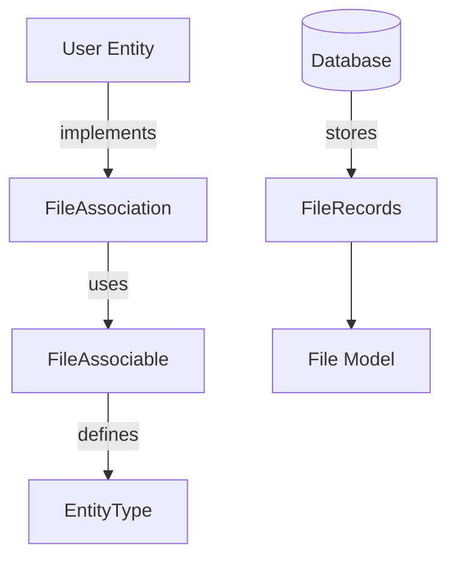

## Overview
A flexible file attachment system implementation supporting multiple entity types with async operations, type safety, and clear ownership tracking.

## System Architecture

### Core Components

#### 1. Trait System (`backend/src/traits/file.rs`)
```rust
pub trait FileAssociable: EntityTrait {
    fn entity_type() -> &'static str;
}

pub trait FileAssociation {
    fn add_file(&self, db: &DatabaseConnection, file_id: Uuid)
        -> impl Future<Output = Result<(), DbErr>> + Send;
}
```

**Key Features:**
- `FileAssociable` trait for entity compatibility
- `FileAssociation` for async operations
- Thread-safe design with `Send` bounds
- Compile-time guarantees through Rust's type system

#### 2. Database Model (`backend/src/entities/file.rs`)
```rust
#[derive(Clone, Debug, PartialEq, DeriveEntityModel)]
#[sea_orm(table_name = "files")]
pub struct Model {
    #[sea_orm(primary_key)]
    pub id: String,
    // ... file metadata fields ...
}

#[derive(Debug, Clone, EnumIter, DeriveActiveEnum)]
#[sea_orm(rs_type = "String", db_type = "String(StringLen::N(1))")]
pub enum StorageType {
    #[sea_orm(string_value = "L")] Local,
    // ... other storage types ...
}
```

**Design Decisions:**
- Dedicated `files` table for metadata
- SeaORM enum mapping for storage types
- String-based IDs for external system compatibility

### Implementation Details

#### 1. Entity Relationships
```rust
impl Related<super::file_association::Entity> for Entity {
    fn to() -> RelationDef {
        Relation::FileAssociation.def()
    }
}
```

**Features:**
- Declarative relationship definitions
- Query building capabilities
- Rust-level referential integrity

#### 2. Association Pattern
- Junction table structure:
  - file_id
  - entity_type (polymorphic)
  - entity_id
- Many-to-many relationship support

#### 3. Type Management
- Database layer: String IDs
- Business layer: UUIDs
- System boundary type conversions

## Technical Deep Dive

### Async Implementation
1. **Thread Safety**
   - Future + Send trait bounds
   - Cross-thread operation safety
   - Async boundary management

2. **Type System Usage**
   - Trait-based polymorphism
   - Entity-specific implementations
   - Shared interface patterns

### Database Operations
1. **Workflow**
   ```rust
   impl FileAssociation for Model {
       async fn add_file(&self, db: &DatabaseConnection, file_id: Uuid) -> Result<(), DbErr> {
           // 1. Find file
           // 2. Create association record
           // 3. Insert into database
       }
   }
   ```

2. **Type Conversions**
   ```rust
   impl From<file::Model> for FileModel {
       fn from(model: file::Model) -> Self {
           FileModel {
               id: Uuid::parse_str(&model.id).unwrap(),
               // ... field conversions ...
           }
       }
   }
   ```

## System Flow


## Best Practices & Lessons

### Design Patterns
1. **Trait Implementation**
   - Interface/implementation separation
   - Flexible return types
   - Associated type usage

2. **Async Safety**
   - Thread-safe futures
   - Compiler verification
   - Ownership tracking

3. **ORM Usage**
   - Relationship-driven queries
   - Pattern selection (Active Record vs Data Mapper)
   - Type-driven development

## Future Improvements
1. Enum dispatch alternative exploration
2. Association strategy benchmarking
3. Advanced SeaORM query implementation
4. Soft deletion support for associations

Projects

