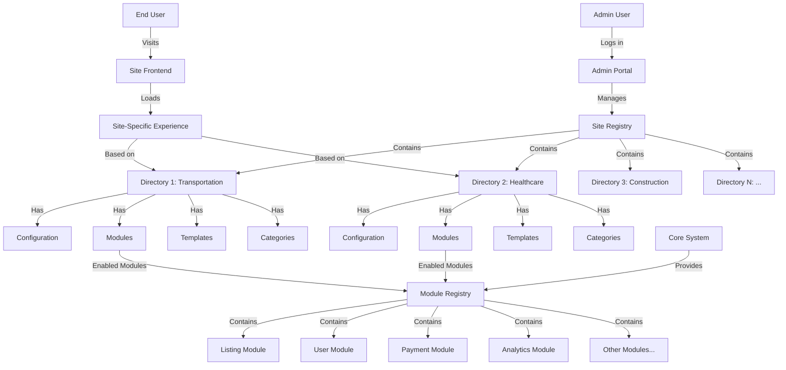

// backend/src/config/site_config.rs
use serde::{Deserialize, Serialize};
use uuid::Uuid;
use std::collections::HashMap;
use bitflags::bitflags;

bitflags! {
    #[derive(Serialize, Deserialize)]
    pub struct ModuleFlags: u32 {
        const LISTINGS = 0b00000001;
        const PROFILES = 0b00000010;
        const MESSAGING = 0b00000100;
        const PAYMENTS = 0b00001000;
        const ANALYTICS = 0b00010000;
        const REVIEWS = 0b00100000;
        const EVENTS = 0b01000000;
        const CUSTOM_FIELDS = 0b10000000;
        // Add more modules as needed
    }
}

#[derive(Serialize, Deserialize, Debug, Clone)]
pub struct SiteConfig {
    pub directory_id: Uuid,
    pub name: String,
    pub domain: String,
    pub enabled_modules: ModuleFlags,
    pub theme: String,
    pub custom_settings: HashMap<String, serde_json::Value>,
}

impl SiteConfig {
    pub fn is_module_enabled(&self, module: ModuleFlags) -> bool {
        self.enabled_modules.contains(module)
    }
}

-- backend/scripts/update_directory_schema.sql
ALTER TABLE directory 
ADD COLUMN enabled_modules INTEGER NOT NULL DEFAULT 0,
ADD COLUMN theme VARCHAR(255) DEFAULT 'default',
ADD COLUMN custom_settings JSONB DEFAULT '{}'::jsonb;

// backend/src/middleware/site_context.rs
use axum::{
    extract::{Extension, Host},
    http::{Request, StatusCode},
    middleware::Next,
    response::Response,
};
use sea_orm::{DatabaseConnection, EntityTrait, ColumnTrait, QueryFilter};
use std::sync::Arc;
use once_cell::sync::Lazy;
use std::collections::HashMap;
use tokio::sync::RwLock;
use crate::entities::directory;
use crate::config::site_config::{SiteConfig, ModuleFlags};

// Cache for site configurations to avoid frequent DB lookups
static SITE_CACHE: Lazy<Arc<RwLock<HashMap<String, SiteConfig>>>> = 
    Lazy::new(|| Arc::new(RwLock::new(HashMap::new())));

pub async fn site_context_middleware<B>(
    Extension(db): Extension<DatabaseConnection>,
    Host(hostname): Host,
    req: Request<B>,
    next: Next<B>,
) -> Result<Response, StatusCode> {
    // Check cache first
    let domain = hostname.split(':').next().unwrap_or(&hostname).to_string();
    
    // Try to get from cache
    let site_config = {
        let cache = SITE_CACHE.read().await;
        cache.get(&domain).cloned()
    };
    
    let site_config = match site_config {
        Some(config) => config,
        None => {
            // Not in cache, fetch from database
            let directory = directory::Entity::find()
                .filter(directory::Column::Domain.eq(&domain))
                .one(&db)
                .await
                .map_err(|_| StatusCode::INTERNAL_SERVER_ERROR)?;
            
            let directory = match directory {
                Some(dir) => dir,
                None => return Err(StatusCode::NOT_FOUND),
            };
            
            // Convert to SiteConfig
            let enabled_modules_value = directory.additional_info
                .get("enabled_modules")
                .and_then(|v| v.as_u64())
                .unwrap_or(0) as u32;
            
            let enabled_modules = ModuleFlags::from_bits_truncate(enabled_modules_value);
            
            let theme = directory.additional_info
                .get("theme")
                .and_then(|v| v.as_str())
                .unwrap_or("default")
                .to_string();
            
            let custom_settings = directory.additional_info
                .get("custom_settings")
                .and_then(|v| v.as_object().cloned())
                .unwrap_or_default();
            
            let config = SiteConfig {
                directory_id: directory.id,
                name: directory.name,
                domain,
                enabled_modules,
                theme,
                custom_settings: custom_settings.into_iter().collect(),
            };
            
            // Update cache
            {
                let mut cache = SITE_CACHE.write().await;
                cache.insert(config.domain.clone(), config.clone());
            }
            
            config
        }
    };
    
    // Add site config to request extensions
    let mut req = req;
    req.extensions_mut().insert(site_config);
    
    // Continue with the request
    Ok(next.run(req).await)
}

// backend/src/handlers/listings.rs
use axum::{
    extract::{Extension, Path, Json},
    http::StatusCode,
};
use crate::config::site_config::{SiteConfig, ModuleFlags};

pub async fn create_listing(
    Extension(site_config): Extension<SiteConfig>,
    // other parameters
) -> Result<impl IntoResponse, StatusCode> {
    // Check if listings module is enabled for this site
    if !site_config.is_module_enabled(ModuleFlags::LISTINGS) {
        return Err(StatusCode::NOT_FOUND); // Or FORBIDDEN, depending on your UX preference
    }
    
    // Continue with listing creation logic
    // ...
}

// backend/src/admin/routes.rs
// Add to your existing admin_routes function
.route("/admin/directories/:directory_id/config", get(get_site_config).put(update_site_config))
.route("/admin/directories/:directory_id/modules", get(get_enabled_modules).put(update_enabled_modules))
.route("/admin/directories/:directory_id/theme", get(get_site_theme).put(update_site_theme))
.route("/admin/directories/:directory_id/custom-settings", get(get_custom_settings).put(update_custom_settings))