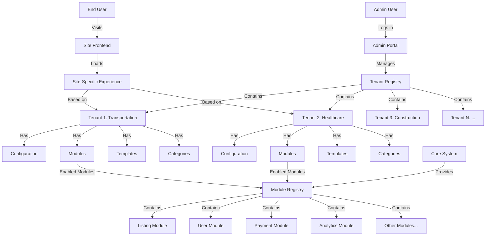

# Multi-Site Management Configuration

## Site Configuration Structure

```rust
#[derive(Serialize, Deserialize, Debug, Clone)]
pub struct SiteConfig {
    // Unique identifier for the tenant
    pub tenant_id: Uuid,
    
    // Display name of the site
    pub name: String,
    
    // Primary domain for accessing the site (e.g., "healthcare.example.com")
    pub domain: String,
    
    // Bitflag configuration controlling which features are available
    pub enabled_modules: ModuleFlags,
    
    // Theme identifier (e.g., "default", "dark", "professional")
    pub theme: String,
    
    // Flexible JSON storage for site-specific settings
    // Examples:
    // - "logo_url": "https://..."
    // - "primary_color": "#FF0000"
    // - "contact_email": "admin@..."
    pub custom_settings: HashMap<String, serde_json::Value>,
}
```

## Module Flags

```rust
bitflags! {
    #[derive(Serialize, Deserialize)]
    pub struct ModuleFlags: u32 {
        // Core listing functionality (required for directory features)
        const LISTINGS = 0b00000001;
        
        // User profiles and account management
        const PROFILES = 0b00000010;
        
        // Internal messaging system between users
        const MESSAGING = 0b00000100;
        
        // Payment processing and subscription management
        const PAYMENTS = 0b00001000;
        
        // Site usage and performance tracking
        const ANALYTICS = 0b00010000;
        
        // User-generated reviews and ratings
        const REVIEWS = 0b00100000;
        
        // Calendar and event management
        const EVENTS = 0b01000000;
        
        // Customizable fields for listings/profiles
        const CUSTOM_FIELDS = 0b10000000;
    }
}
```

## Usage Examples

### Enabling Modules
```rust
// Enable listings and profiles for a basic directory
site_config.enabled_modules = ModuleFlags::LISTINGS | ModuleFlags::PROFILES;

// Full-featured directory with all modules
site_config.enabled_modules = ModuleFlags::LISTINGS 
    | ModuleFlags::PROFILES 
    | ModuleFlags::MESSAGING 
    | ModuleFlags::PAYMENTS 
    | ModuleFlags::ANALYTICS 
    | ModuleFlags::REVIEWS 
    | ModuleFlags::EVENTS 
    | ModuleFlags::CUSTOM_FIELDS;
```

### Custom Settings Examples
```rust
// Basic site customization
{
    "logo_url": "https://example.com/logo.png",
    "contact_email": "support@example.com",
    "social_links": {
        "facebook": "https://facebook.com/mysite",
        "twitter": "https://twitter.com/mysite"
    },
    "appearance": {
        "primary_color": "#FF0000",
        "secondary_color": "#00FF00",
        "font_family": "Arial"
    }
}
```

## Caching Behavior

- Site configurations are cached in memory using `SITE_CACHE`
- Cache is keyed by domain name
- Cache is updated when:
  1. Configuration is first accessed
  2. Configuration is explicitly updated via admin panel
- Cache reduces database load for frequently accessed configurations

## Security Considerations

1. Module flags should be validated on both client and server side
2. Custom settings should be sanitized before storage
3. Domain verification required for custom domain setup
4. Cache invalidation needed when configurations are updated

## Performance Notes

- Use `is_module_enabled()` for feature checks
- Cache reduces database load
- Consider periodic cache cleanup for inactive sites
- Monitor custom_settings size to prevent excessive JSON storage

// backend/src/config/site_config.rs
use serde::{Deserialize, Serialize};
use uuid::Uuid;
use std::collections::HashMap;
use bitflags::bitflags;

bitflags! {
    #[derive(Serialize, Deserialize)]
    pub struct ModuleFlags: u32 {
        const LISTINGS = 0b00000001;
        const PROFILES = 0b00000010;
        const MESSAGING = 0b00000100;
        const PAYMENTS = 0b00001000;
        const ANALYTICS = 0b00010000;
        const REVIEWS = 0b00100000;
        const EVENTS = 0b01000000;
        const CUSTOM_FIELDS = 0b10000000;
        // Add more modules as needed
    }
}

#[derive(Serialize, Deserialize, Debug, Clone)]
pub struct SiteConfig {
    pub tenant_id: Uuid,
    pub name: String,
    pub domain: String,
    pub enabled_modules: ModuleFlags,
    pub theme: String,
    pub custom_settings: HashMap<String, serde_json::Value>,
}

impl SiteConfig {
    pub fn is_module_enabled(&self, module: ModuleFlags) -> bool {
        self.enabled_modules.contains(module)
    }
}

-- backend/scripts/update_directory_schema.sql
ALTER TABLE directory 
ADD COLUMN enabled_modules INTEGER NOT NULL DEFAULT 0,
ADD COLUMN theme VARCHAR(255) DEFAULT 'default',
ADD COLUMN custom_settings JSONB DEFAULT '{}'::jsonb;

// backend/src/middleware/site_context.rs
use axum::{
    extract::{Extension, Host},
    http::{Request, StatusCode},
    middleware::Next,
    response::Response,
};
use sea_orm::{DatabaseConnection, EntityTrait, ColumnTrait, QueryFilter};
use std::sync::Arc;
use once_cell::sync::Lazy;
use std::collections::HashMap;
use tokio::sync::RwLock;
use crate::entities::tenant;
use crate::config::site_config::{SiteConfig, ModuleFlags};

// Cache for site configurations to avoid frequent DB lookups
static SITE_CACHE: Lazy<Arc<RwLock<HashMap<String, SiteConfig>>>> = 
    Lazy::new(|| Arc::new(RwLock::new(HashMap::new())));

pub async fn site_context_middleware<B>(
    Extension(db): Extension<DatabaseConnection>,
    Host(hostname): Host,
    req: Request<B>,
    next: Next<B>,
) -> Result<Response, StatusCode> {
    // Check cache first
    let domain = hostname.split(':').next().unwrap_or(&hostname).to_string();
    
    // Try to get from cache
    let site_config = {
        let cache = SITE_CACHE.read().await;
        cache.get(&domain).cloned()
    };
    
    let site_config = match site_config {
        Some(config) => config,
        None => {
            // Not in cache, fetch from database
            let database_tenant = tenant::Entity::find()
                .filter(tenant::Column::Domain.eq(&domain))
                .one(&db)
                .await
                .map_err(|_| StatusCode::INTERNAL_SERVER_ERROR)?;
            
            let tenant_record = match database_tenant {
                Some(dir) => dir,
                None => return Err(StatusCode::NOT_FOUND),
            };
            
            // Convert to SiteConfig
            let enabled_modules_value = tenant_record.additional_info
                .get("enabled_modules")
                .and_then(|v| v.as_u64())
                .unwrap_or(0) as u32;
            
            let enabled_modules = ModuleFlags::from_bits_truncate(enabled_modules_value);
            
            let theme = directory.additional_info
                .get("theme")
                .and_then(|v| v.as_str())
                .unwrap_or("default")
                .to_string();
            
            let custom_settings = directory.additional_info
                .get("custom_settings")
                .and_then(|v| v.as_object().cloned())
                .unwrap_or_default();
            
            let config = SiteConfig {
                tenant_id: tenant_record.id,
                name: tenant_record.name,
                domain,
                enabled_modules,
                theme,
                custom_settings: custom_settings.into_iter().collect(),
            };
            
            // Update cache
            {
                let mut cache = SITE_CACHE.write().await;
                cache.insert(config.domain.clone(), config.clone());
            }
            
            config
        }
    };
    
    // Add site config to request extensions
    let mut req = req;
    req.extensions_mut().insert(site_config);
    
    // Continue with the request
    Ok(next.run(req).await)
}

// backend/src/handlers/listings.rs
use axum::{
    extract::{Extension, Path, Json},
    http::StatusCode,
};
use crate::config::site_config::{SiteConfig, ModuleFlags};

pub async fn create_listing(
    Extension(site_config): Extension<SiteConfig>,
    // other parameters
) -> Result<impl IntoResponse, StatusCode> {
    // Check if listings module is enabled for this site
    if !site_config.is_module_enabled(ModuleFlags::LISTINGS) {
        return Err(StatusCode::NOT_FOUND); // Or FORBIDDEN, depending on your UX preference
    }
    
    // Continue with listing creation logic
    // ...
}

// backend/src/admin/routes.rs
// Add to your existing admin_routes function
.route("/admin/tenants/:tenant_id/config", get(get_site_config).put(update_site_config))
.route("/admin/tenants/:tenant_id/custom-settings", get(get_custom_settings).put(update_custom_settings))

## Infrastructure & Dynamic Routing

To truly support a scalable multi-site environment, the backend logic works hand-in-hand with our proxy layers. 

1. **Proxy Layer:** The system uses Caddy (locally) or Kubernetes Ingress (in production) to capture all wildcard subdomains or mapped domains (e.g. `*.directory.localhost` or `client1.com`).
2. **Container Passthrough:** The proxy forwards the requests to the **same** static `directory-instance` container natively retaining the original `Host` HTTP Header.
3. **Instance Lookup:** The frontend Rust app reads the `Host` header and immediately calls the Backend Lookup API (e.g., `http://127.0.0.1:8000/directories/lookup?domain={domain}`).
4. **Content Serving:** If the database contains matching configurations based on the origin, the specific theme and settings are generated securely, achieving thousands of multi-tenant sites from a single deployment instance.

---

&copy; Copyright Ruud Salym Erie & Oplyst International, LLC. All Rights Reserved.